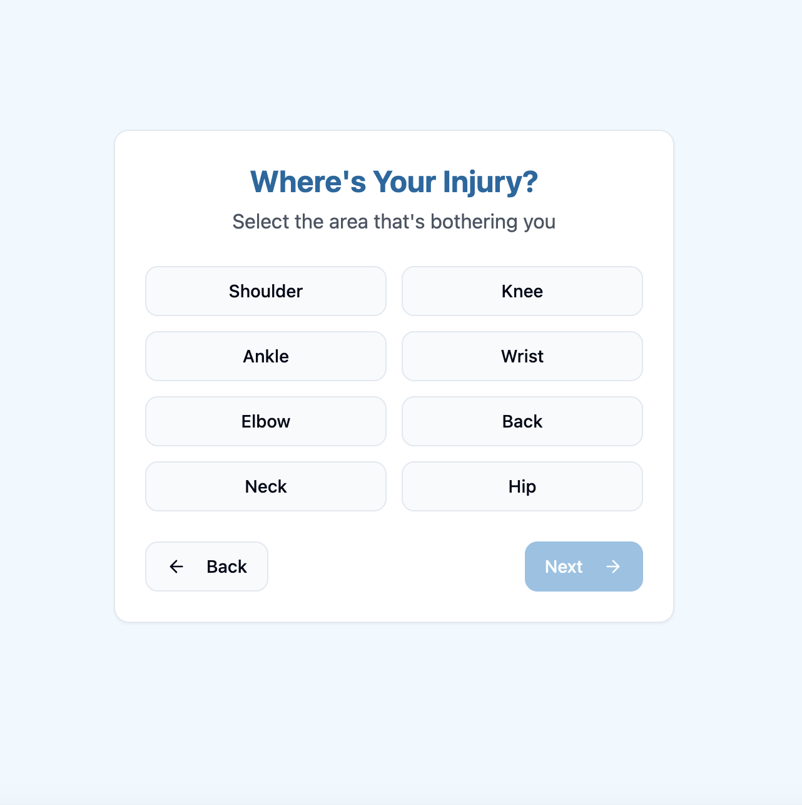
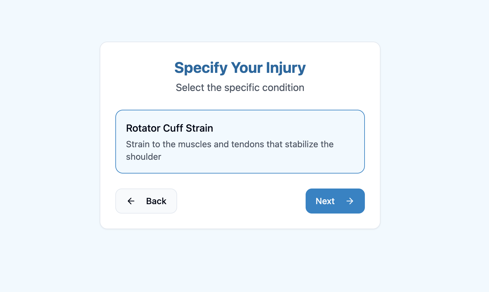
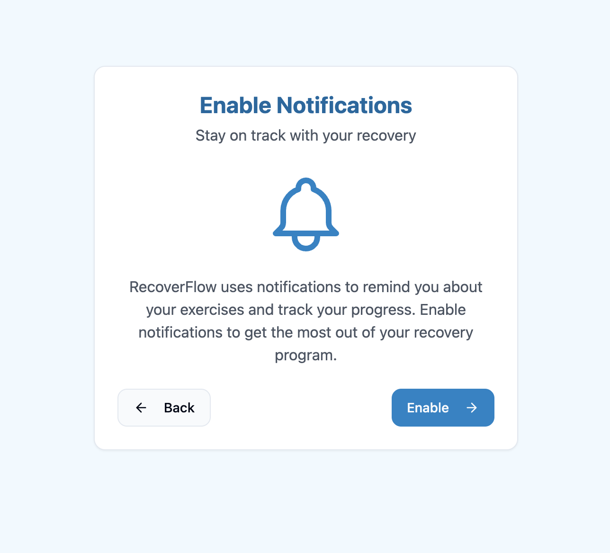

# Mobile Recovery App for Soft Tissue Injuries

RecoverFlow is a React Native application designed to assist patients in following personalized, injury-specific recovery programs. Built with a focus on security, engagement, and adaptability, the app ensures smooth onboarding, continuous progress tracking, and HIPAA-compliant data handling.

## Project Features

- **Personalized Recovery Plans**: Curated recovery workflows based on soft tissue injury types
- **Secure Onboarding**: HIPAA-compliant user authentication and encrypted local data storage
- **Goal-Based Progress Tracking**: Visual indicators and recovery checkpoints to motivate users
- **Adaptive Recommendations**: Intelligent plan suggestions based on user activity and pain logs
- **Usage Tracking**: Monitors adherence to therapy routines and triggers reminder notifications
- **Pain Level Logs**: Allows patients to record and visualize pain variations over time
- **Strapi Integration**: Secure API communication with a headless CMS backend
- **Mobile-Optimized UI**: Built with responsive design using Tailwind CSS and shadcn-ui

## Technical Stack

- **Frontend**: React Native, TypeScript, Tailwind CSS
- **Backend**: Strapi CMS (Node.js)
- **UI Kit**: shadcn/ui
- **Build Tool**: Vite

## 📱 Screenshots

Here are a few screens from the RecoverFlow mobile app illustrating key functionality:

| Injury Location Selection | Injury Type Selection | Push Notification Reminder |
|---------------------------|------------------------|----------------------------|
|  |  |  |

Each screen demonstrates a critical step in guiding users through their recovery journey, enhancing engagement through a clean and intuitive interface.


## How to Run Locally

Make sure you have [Node.js & npm](https://github.com/nvm-sh/nvm#installing-and-updating) installed.

```bash
# 1. Clone the repository
git clone <YOUR_GIT_URL>

# 2. Navigate into the project folder
cd <YOUR_PROJECT_NAME>

# 3. Install dependencies
npm install

# 4. Start the development server
npm run dev
